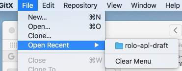
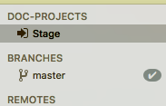
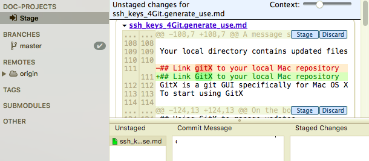
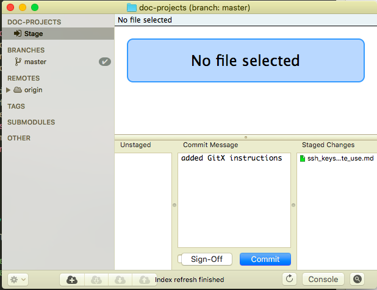
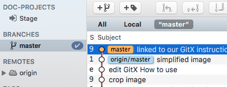

**STOP**: The prerequisite for this document is [Tools-for-ISDB-TechWriters](https://github-infosec.COMPANY.com/documents/doc-projects/blob/master/Tools-for-ISDB-TechWriters.md). Specifically, you must install GitHub and GitX before auhorizing and linking them. 

# Setting up your Mac to use git tools on COMPANY IS files

This document is written for InfoSec techincal writers. It describes how to setup SSH keys when configuring git, GitX, and GitHub on your local workstation.  

<big> **Table of Contents** </big>

- [Setting up your Mac to use git tools on COMPANY IS files](#setting-up-your-mac-to-use-git-tools-on-COMPANY-is-files)  
- [Overview](#overview)  
- [GitHub and Secure Shell Keys](#github-and-secure-shell-keys)  
   * [Check and generate public and private SSH keys](#check-and-generate-public-and-private-ssh-keys) 
   * [Permanently authorize SSH key](#permanently-authorize-ssh-key)   
   * [Add SSH key to GitHub](#add-ssh-key-to-github)  
- [Preparing to use GitX](#preparing-to-use-gitx)   
   * [Clone a repository with git and GitHub](#clone-a-repository-with-git-and-github) 
   * [Link GitX to your local Mac repository](#link-gitx-to-your-local-mac-repository) 
- [Using GitX to manage updates](#using-gitx-to-manage-updates) 
- [Summary](#summary)

<small><i><a href='http://ecotrust-canada.github.io/markdown-toc/'>Table of contents generated with markdown-toc</a></i></small>

# Overview
The following links are in sequence to set up your mac workstation:

1. [Generate SSH keys](https://github-infosec.COMPANY.com/documents/doc-projects/blob/master/Tools.ssh_keys_for_git.md "Check-and-generate-private-and-public-SSH-keys" target="_self").
2. [Authorize key in an agent's session](https://github-infosec.COMPANY.com/documents/doc-projects/blob/master/ssh_keys_4Git.generate_use.md#permanently-authorize-ssh-key).
3. [Install and add key to GitHub](https://github-infosec.COMPANY.com/documents/doc-projects/blob/master/ssh_keys_4Git.generate_use.md#Add-SHH-key-to-GitHub).
4. [Find git path from GitHub SSH clone option](https://github-infosec.COMPANY.com/documents/doc-projects/blob/master/ssh_keys_4Git.generate_use.md "Clone-a-repository-with-git-and-GitHub" target="_self").
4. [Clone repo with a git command](https://github-infosec.COMPANY.com/documents/doc-projects/blob/master/ssh_keys_4Git.generate_use.md#"permanently-authorize-ssh-key").
5. [Install and Open GitX](https://github-infosec.COMPANY.com/documents/doc-projects/blob/master/ssh_keys_4Git.generate_use.md#"Link-gitX-to-your-local-Mac-repository"). 
6. [Link GitX to your local repo](https://github-infosec.COMPANY.com/documents/doc-projects/blob/master/ssh_keys_4Git.generate_use.md#"Link-gitX-to-your-local-Mac-repository"). -->

## GitHub and Secure Shell Keys
This section describes how to configure your Mac to work with IS technical pubs GitHub repositories (repos). 

&#9658; **Note:** GitHub is a web-based Git repo. GitX is a git GUI specifically for macOS. 

### Check and generate public and private SSH keys
1. Open a **terminal window**. 
2. Enter: **`ls -al ~/.ssh`**  
   A list of your .ssh directory config and key files appears.  
3. Generate a **new key pair** (even if you already have keys). 
   `ssh-keygen -t rsa -b 4096 -C "[*email@address.com*]"`  
4. Enter: **`y`** to overwrite files with the default names.
5. Enter a *passphrase*.

 
### Permanently authorize SSH key

This section describes how to **permanently authorize the SSH key** in the agent's session, by running the ssh-agent in the background. By doing this, it keeps the key loaded into memory so that the passphrase is automatically known every time you use the key on your mac.

1. Run the agent. 
   Enter: **`eval "$(ssh-agent -s)"`**
2. Store the passphrase in your keychain ("-K" parameter is specifically for Mac OS).   
   Enter: **`ssh-add -K ~/.ssh/id_rsa`**
 

&#9658; **Tip:** [SSH curious? Here's more info...](https://www.ssh.com/ssh/add)

### Add SSH key to GitHub

Use your new SSH key to configure your GitHub account.

 1. (*If GitHub is missing*) [Install GitHub from this page](https://github-infosec.COMPANY.com/documents/doc-projects/blob/master/Tools-for-ISDB-TechWriters.md). 
 2. Copy the secure key into your buffer.   
    Enter: **`pbcopy < ~/.ssh/id_rsa.pub`**
 2. From a browser window, **launch GitHub**
 3. In the upper-right corner of GitHub, **click** "View profile and more".
 4. Choose **"Settings"**.
 4. Locate the "Personal Settings" left-sidebar.
 5. Click **"SSH and GPG keys"**.
 5. In the upper right, click **"New SSH key"**.
 6. Paste the (very long) key in your buffer from the `pbcopy` command.
 6. In the lower left, click **"Add SSH key"**.

## Preparing to use GitX

Repos exist on a network server. You can create a local repo copy on your system, edit those local files with [MacDown](https://macdown.uranusjr.com/), and then use GitX to keep your copy up-to-date and to submit changes.

### Clone a repository with git and GitHub
Pull down a local repo with GitHub before running GitX. 
	
1. In GitHub, click the green **"Clone or download"**.  
  &nbsp; &nbsp; A "Clone with SSH/HTTPS" pop-up window appears. 
2. Toggle functionality to "Clone with SSH" by clicking the **"Use SSH" link**  
&#9658; **Note:** When the option is set to **Clone with SSH**, the link will read "Use HTTPS". 

3. To copy the path, click the **tiny clipboard icon** next to the `git@github...` path.
4. Open a **terminal window**.
5. From the terminal window, **navigate to your intended working directory** such as,   `$cd ~/[Documents/<local-tech-projects>]`   
6. Enter:  
      **`git clone`** 
   Paste the clipboad contents after "clone", so that it looks *something like*: 
      `git clone git@github-infosec.COMPANY.com:documents/rolo-api-draft.git` 

&#9658; **Note:** The actual `github-infosec.COMPANY.com` full path depends on which file types you are working with.

A message stream appears on the terminal window: 
`Cloning into 'doc-projects'...` 
`remote: Counting objects: 619, done.` 
&nbsp; &nbsp; .   &nbsp; &nbsp; .  &nbsp; &nbsp; .  
`Resolving deltas: 100% (8888/8888). done`  

Your local directory contains updated files from the server directory.

### Link GitX to your local Mac repository
GitX is a git GUI specifically for macOS. It features a history viewer and a commit GUI. As a tech writer, GitX is most helpful because, unlike GitHub, GitX can process multiple files at a time.
To start using GitX
	
1. (*If GitX is missing*) [Install GitX from this page](https://github-infosec.COMPANY.com/documents/doc-projects/blob/master/Tools-for-ISDB-TechWriters.md)
2.Launch the **GitX app**.
2. On the File menu, click **Open**.
3. Navigate to a **git-cloned directory**, such as `/Documents/local-tech-projects/rolo-api-draft` 
A [branch:master] window appears with action choices.  
On the bottom left, a gear menu and cloud icons shows options to push, pull, add, and fetch. 

&#9658; **Tip:** [GitX curious? Here's more info...](http://gitx.frim.nl/user_manual.html)
 
### Using GitX to manage updates

1. At the start of each work session, refresh your local repository (pull everyone else's changes from the Origin to update your local master) prior to editing and updating the remote repo. In gitX, click **Master** under **Branches**, then do either:

  * Right-click on the top Subject line (shd have orange Master) and select Pull Origin And Update Master.
  * On the bottom of the frame, click the down-arrow cloud.  .   

2. Edit local files with [MacDown](https://macdown.uranusjr.com/). 

3. At the end of each work session, commit, and update origin. In gitx:

   11. Open your local working directory (Open Recent or Open...)   

   12. In the left panel, select Stage.
   
        
       The files you changed appear in the Unstaged panel (green for updates, red for deleted files, uncolored for new files). These are the files that can go to the repo. 

   13. In the lower panel in the Unstaged section, click file name(s).  
       The file name(s) move to the Staged Changes panel.  
         

   14. In the Commit Message section, enter a short comment about the updated and staged files.  
        

   15. Below the Commit Message section, click **Commit**.  
        

   16. In the top left panel, click **Master**.  
        

   17. Repeat step 1 to pull any recent changes from others.
   
   18. Push your committed changes to the Origin (the main repo). Either:
      * Right-click top **Subject line** (orange Master) and select **Push Updates to Origin**.
      
      * On the bottom of the frame:
	      * Click the **gear wheel** and select **Pull origin to update master**.       
	      
	      * Click the **gear wheel** and select **Push master to origin**.  
	         
	         
      * On the bottom of the frame, click the **up-arrow cloud**.  
        
      
    	 The master branch panel content is refreshed √ .   
&nbsp;&nbsp; 

 

## Summary
This document ultimately describes how to set up GitX on a MacBook:

1. [Check and generate public and private SSH keys](#check-and-generate-public-and-private-ssh-keys) 
1. [Permanently authorize SSH key](#permanently-authorize-ssh-key)   
1. [Add SSH key to GitHub](#add-ssh-key-to-github)  
1. [Preparing to use GitX](#preparing-to-use-gitx)   
1. [Clone a repository with git and GitHub](#clone-a-repository-with-git-and-github) 
1. [Link GitX to your local Mac repository](#link-gitx-to-your-local-mac-repository) 
1. [Using GitX to manage updates](#using-gitx-to-manage-updates) 

	
<!-- # When things don't go as expected -->

